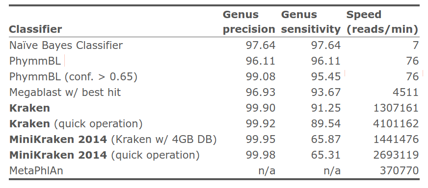

# Soil diversity 
We are going to look at 2 samples coming from bulk soil and rhizosphere, use a taxonomic profiling program and calculate simple diversity metrics. 


Lets first create a new folder for our analysis :

    cd Projects
    mkdir Soil_diversity
    cd Soil_diversity
  **mkdir** :  "make directory" allows to create a new directory

### Quality of reads
We are going to use Reads stored in .fastq files at ~/Data/Soil/
Fastq is a format storing both read sequences (ATGC), and quality of sequences :  it is a score related to the probability that a base is called incorrectly, the lower the most probable there is an error.

In order to process all reads and obtain a global idea of quality, we are going to use fastqc.

    fastqc file -o output
    

 - **file** : fasta file you want to analyze
 - **\-o** : specify where you want to store the result
```
mkdir Read_Quality
for file in ~/Data/Soil/*
do
	fastqc $file -o Read_Quality&
done
```    
*New command* :  **&** add it at the end of a command line, allows to "detach" a command, the terminal will not wait for the end of the command before moving to the next one.

### Taxonomy profiling
   
We are going to use kraken, a tool to find from which organism each read come from. It works by trying to map reads to a database of representative organisms. 

##### Kraken usage 

    kraken --db path_to_database --threads nb --preload --output where_to_put_results  File
    

 - **\-\-db**  allows to precise the path to the database you are going to use for the profiling.
 - **\-\-threads** is used for parallel execution, if your computer possess more than one cpu, you can use this option.
 -   **\-\-preload**  preload the database.
 -  **\-\-output** allows to specify where you want to store  results.
 - **File** the file containing the reads that you want to profile.

##### Can we parallelize ?

    lscpu

can we?

##### Rhizosphere_Sub.fastq
```
mkdir Kraken
kraken --db ~/Databases/minikraken_20141208/ --threads 8 --preload --output Kraken/Rhizosphere.kraken  ~/Data/Soil/Rhizosphere_Sub.fastq
```
##### Bulk_Soil_Sub.fastq
```
kraken --db ~/Databases/minikraken_20141208/ --threads 8 --preload --output Kraken/Bulk_Soil.kraken  ~/Data/Soil/Bulk_Soil_Sub.fastq
```

#### Why not write a script for arbritary number of fastq files?
    for file in ~/Data/Soil/*fastq
    do
	    echo "File=$file"
        base=${file##*/}
        echo "Base=$base"
        stub=${base%_Sub.fastq}
        echo "Stub=$stub"
        kraken --db ~/Databases/minikraken_20141208/ --threads 8 --preload --output Kraken/${stub}.kraken  $file
    done
New commands : 

 - **${name##pattern}** :  text processing command, it looks at the start of name (prefix) and delete the biggest match to pattern, in our case with **\*/**  as a pattern, it will delete all the path present before the sample name.  
 - **${name%pattern}** :  text processing command, it looks at the end of name (suffix) and delete match to pattern, in our case with **_Sub.fastq**  as a pattern, it will only keep the sample name without Sub.fastq.  

#### Results

    cd Kraken
    less Rhizosphere.kraken

 - Col1 : U=unclassified or C=Classified
 - Col2 : Name of read
 - Col3 : The taxonomy ID Kraken used to label the sequence, 0 if unclassified
 - Col4 : Length of read (nucleotides)
 - Col5 : it's complicated

A better way to interpret results is to generate a report :
```
for file in *.kraken
do 
	kraken-report --db ~/Databases/minikraken_20141208/ $file  >  $file.report
done
```

 - Col1 : Percentage of reads described by this taxon (include also reads from finer taxonomic level)
 - Col2 : Number of reads described this taxon (include also reads from finer taxonomic level)
 - Col3 : Number of reads directly assigned to this taxon
 - Col4 : Taxonomic rank,  ( U)nclassified, ( D)omain, ( K)ingdom, ( P)hylum, ( C)lass, ( O)rder, ( F)amily, ( G)enus, or ( S)pecies.         
 - Col5 : NCBI taxonomy ID   
 - Col6 : Indented scientific name

Only a few reads have been successfully classified. 
Any idea why?

 
**Precision** : out of all reads classified, percent which are well classified
**Sensitivity** : percent of successfully classified reads

### Calcul of diversity
First lets filter the kraken report to only keep genus level information.
```
cd ../
for file in Kraken/*.kraken.report
do
    stub=${file%.kraken.report}
    cat  $file | awk '$4=="G"' > $stub.genera
done
```

 - **cat** read the whole file and print it on screen
 - **awk** is a versatile tool used for various simple text processing. In this case we ask it to select any line for which the 4th element is "G" : we are filtering for genus level annotation 

Then, we use a small script to extract the genera profile information of each sample and store it into a .csv file

    CollateK.pl Kraken > GeneraKraken.csv
    less GeneraKraken.csv

Use R to read this file and calculate the alpha diversity.  

    R
    library(vegan)
    SpeciesKraken <-read.csv("SpeciesKraken.csv",header=TRUE,row.names=1)
    SpeciesKraken <- t(SpeciesKraken)
    alpha <- data.frame(fisher.alpha(GeneraKraken))
    alpha

Do we observe an important difference in diversity?


